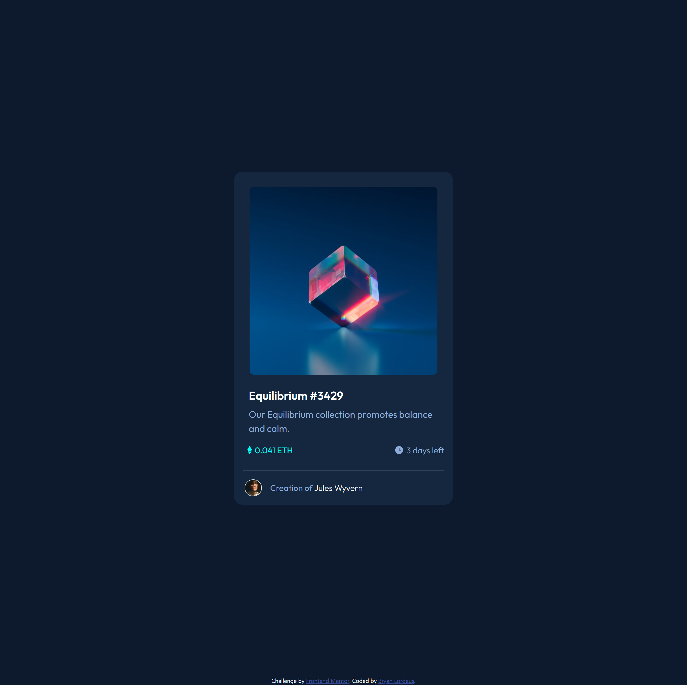
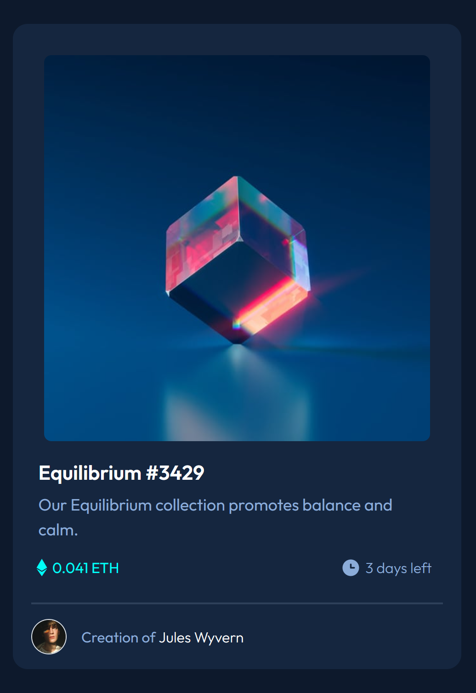

# Frontend Mentor - NFT preview card component solution

This is a solution to the [NFT preview card component challenge on Frontend Mentor](https://www.frontendmentor.io/challenges/nft-preview-card-component-SbdUL_w0U). Frontend Mentor challenges help you improve your coding skills by building realistic projects.

## Table of contents

* [Overview](#overview)
    * [The challenge](#the-challenge)
    * [Screenshot](#screenshot)
    * [Links](#links)
* [My process](#my-process)
    * [Built with](#built-with)
    * [What I learned](#what-i-learned)
    * [Continued development](#continued-development)
    * [Useful resources](#useful-resources)
* [Author](#author)

## Overview

### The challenge

Users should be able to:

* View the optimal layout depending on their device's screen size
* See hover states for interactive elements

### Screenshot




### Links

* Solution URL: [Solution](https://your-solution-url.com)
* Live Site URL: [Live Site](https://your-live-site-url.com)

## My process

### Built with

* Semantic HTML5 markup
* CSS
* Bootstrap
* CSS Grid
* Mobile-first workflow
* Sass

### What I learned

For this project, I wanted to rely more on Bootstrap's spacing utilities, which helped remove the uncertainty of which properties to use.

``` html
<h2 class="mx-3 pb-auto"><span class="heading">Equilibrium #3429</span></h2>
```

I also used the mix-blend-mode to bring out the view icon on the hover state.

``` css
.overlay:hover {
  opacity: 70%;
  mix-blend-mode: screen;
}
```

### Continued development

One area I had trouble with was applying a hover effect to the image. I looked up many different ways to apply an overlapping color to an image, but none of them achieved the effect that I was looking for. So I ended up just using the mix-blend-mode CSS property to create a similar effect.

### Useful resources

* [Bootstrap Spacing](https://getbootstrap.com/docs/5.3/utilities/spacing/) \- I relied more on using Bootstrap's spacing utilities to apply proper spacing to each element\.

## Author

* Frontend Mentor - [@blordeus](https://www.frontendmentor.io/profile/blordeus)
* Twitter - [@blordeus](https://www.twitter.com/blordeus)